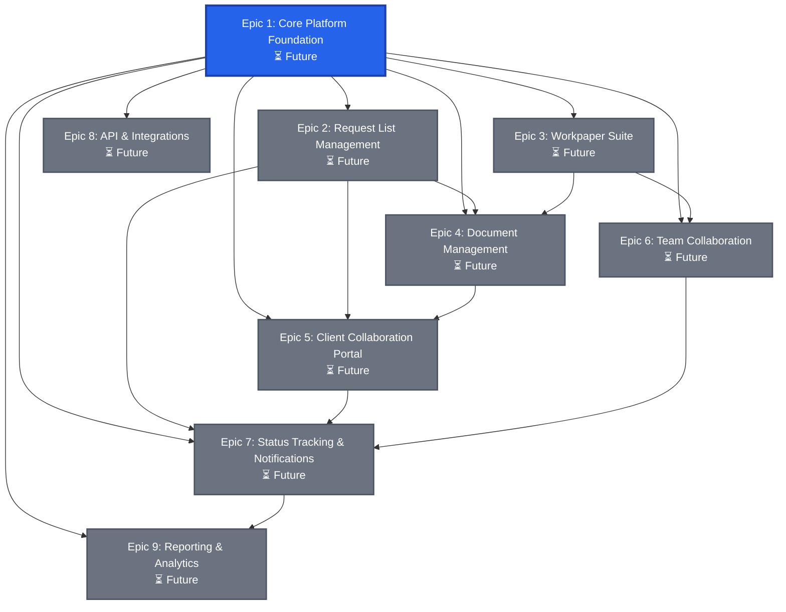

# Product Requirements Document (PRD)
## CurrentMesh - Request Management & Workpaper Platform

**Status**: `draft`  
**Version**: 1.1  
**Created**: 2025-12-31  
**Last Updated**: 2025-12-31  
**Owner**: Mario Alasu  
**Domain**: currentmesh.com

---

## Executive Summary

**🎯 Project Status**: Planning Phase | Infrastructure Setup Complete  
**🚀 Current Focus**: Infrastructure Complete - Ready for Epic 1 Development  
**💰 Business Impact**: Streamline audit workflows, reduce manual document management overhead  
**📈 Success Metrics**: Request completion time, team collaboration efficiency, document organization

### Epic Dependency Graph

The following diagram shows relationships and dependencies between all epics. Use this to understand build order, integration points, and feature dependencies.



**Legend:**
- **Solid arrows (→)**: Direct dependency (Epic B requires Epic A)
- **Foundation (Blue)**: Core infrastructure that all epics depend on
- **Future (Gray)**: Planned but not yet started

**Key Dependency Patterns:**
- **Foundation First**: [[Epic 1: Core Platform Foundation]] is required by all other epics
- **Request Management**: [[Epic 2: Request List Management]] enables document requests and client collaboration
- **Workpaper Organization**: [[Epic 3: Workpaper Suite]] depends on document management
- **Collaboration Chain**: Team collaboration and status tracking enable efficient workflows

### Quick Status Overview
| Epic | Status | Key Feature | Dependencies |
|------|--------|-------------|--------------|
| [[Epic 1: Core Platform Foundation]] | ⏳ Future | Authentication, user management, basic UI | Foundation |
| [[Epic 2: Request List Management]] | ⏳ Future | Request creation, tracking, assignment | [[Epic 1]] |
| [[Epic 3: Workpaper Suite]] | ⏳ Future | Workpaper organization, templates | [[Epic 1]], [[Epic 4]] |
| [[Epic 4: Document Management]] | ⏳ Future | File upload, storage, versioning | [[Epic 1]] |
| [[Epic 5: Client Collaboration Portal]] | ⏳ Future | Client access, document sharing | [[Epic 1]], [[Epic 2]], [[Epic 4]] |
| [[Epic 6: Team Collaboration]] | ⏳ Future | Team workspaces, comments, mentions | [[Epic 1]] |
| [[Epic 7: Status Tracking & Notifications]] | ⏳ Future | Request status, email/SMS notifications | [[Epic 1]], [[Epic 2]] |
| [[Epic 8: API & Integrations]] | ⏳ Future | REST API, webhooks, third-party integrations | [[Epic 1]] |
| [[Epic 9: Reporting & Analytics]] | ⏳ Future | Dashboards, metrics, exports | [[Epic 1]], [[Epic 2]], [[Epic 7]] |

### Key Deliverables Planned
- ✅ **Request Management System** for organizing and tracking document requests
- ✅ **Workpaper Suite** for audit workpaper organization and templates
- ✅ **Document Management** with versioning and secure storage
- ✅ **Client Collaboration Portal** for secure client access and document sharing
- ✅ **Team Collaboration** with workspaces, comments, and real-time updates
- ✅ **Status Tracking** with automated notifications and workflow management

---

## 1. Project Overview

### 1.1 Vision Statement
Build a comprehensive request management and workpaper platform that revolutionizes how audit teams manage document requests, organize workpapers, and collaborate with clients. The system streamlines audit workflows, reduces manual overhead, and provides secure collaboration tools for teams and clients.

### 1.2 Project Goals
- **Streamline Request Management**: Centralize document requests with automated tracking and status updates
- **Organize Workpapers**: Provide structured workpaper organization with templates and categorization
- **Improve Collaboration**: Enable seamless team and client collaboration with real-time updates
- **Ensure Security**: Implement enterprise-grade security for sensitive audit documents
- **Scale Operations**: Support multiple teams, clients, and projects with multi-tenant architecture

### 1.3 Success Metrics
**Target Metrics (Baseline TBD):**
- **Request Completion Time**: 30%+ reduction in average request completion time (baseline: TBD)
- **Document Organization**: 50%+ reduction in time spent searching for documents (baseline: TBD)
- **Client Satisfaction**: 90%+ client satisfaction score (baseline: TBD)
- **Team Efficiency**: 25%+ improvement in team productivity metrics (baseline: TBD)
- **System Uptime**: 99.9% availability (baseline: TBD)

**Note**: Baseline metrics will be established after 30 days of production use.

### 1.4 Project Scope
**In Scope:**
- **Request List Management**: Create, track, and manage document requests
- **Workpaper Suite**: Organize and manage audit workpapers with templates
- **Document Management**: Secure file storage, versioning, and organization
- **Client Collaboration Portal**: Secure client access for document submission and review
- **Team Collaboration**: Workspaces, comments, mentions, and real-time collaboration
- **Status Tracking**: Automated status updates and notifications
- **Multi-tenant Support**: Support multiple teams and organizations

**Out of Scope:**
- Mobile native apps (web-responsive only)
- Advanced AI document analysis (future consideration)
- Video conferencing integration (future consideration)
- Third-party accounting software integrations (future consideration)

---

## 2. Business Requirements

### 2.1 Business Objectives
1. **Centralize Request Management**: Single platform for all document requests with automated tracking
2. **Organize Workpapers**: Structured workpaper organization with templates and categorization
3. **Enable Client Collaboration**: Secure portal for clients to submit documents and track requests
4. **Improve Team Efficiency**: Real-time collaboration tools to reduce communication overhead
5. **Ensure Document Security**: Enterprise-grade security for sensitive audit documents
6. **Scale Operations**: Support multiple teams, clients, and projects

### 2.2 Target Users

#### Primary User: Audit Team Member
- **Needs**: Quick request creation, document organization, status tracking
- **Pain Points**: Scattered requests, manual tracking, lost documents
- **Goals**: Save time, improve organization, ensure nothing falls through cracks

#### Secondary User: Audit Manager
- **Needs**: Team oversight, project status, resource allocation
- **Pain Points**: Lack of visibility, manual reporting, coordination challenges
- **Goals**: Track team progress, identify bottlenecks, ensure compliance

#### Tertiary User: Client
- **Needs**: Easy document submission, request clarity, status visibility
- **Pain Points**: Unclear requests, multiple communication channels, lost documents
- **Goals**: Submit documents easily, understand requirements, track progress

### 2.3 Business Rules
- All documents must be encrypted at rest and in transit
- Client access must be secure and auditable
- Request status must be automatically tracked and updated
- Document versioning must be maintained for audit trails
- Multi-tenant data isolation required
- Audit logging for all sensitive operations

---

## 3. User Personas

### 3.1 Primary Persona: Audit Team Member
**Name**: Sarah Chen  
**Role**: Senior Auditor  
**Experience**: 5+ years  
**Tech Comfort**: High

**Goals:**
- Quickly create and manage document requests
- Organize workpapers efficiently
- Track request status and client responses
- Collaborate with team members seamlessly
- Access documents from anywhere

**Frustrations:**
- Scattered requests across email and spreadsheets
- Manual status tracking
- Lost or misplaced documents
- Difficulty finding previous workpapers
- Lack of visibility into client response status

**How CurrentMesh Helps:**
- Centralized request management dashboard
- Automated status tracking
- Organized workpaper library with search
- Real-time team collaboration
- Secure document storage with versioning

### 3.2 Secondary Persona: Audit Manager
**Name**: Michael Rodriguez  
**Role**: Audit Manager  
**Experience**: 10+ years  
**Tech Comfort**: Moderate

**Goals:**
- Monitor team progress and project status
- Identify bottlenecks and resource needs
- Ensure compliance and quality standards
- Generate reports for stakeholders
- Manage multiple projects simultaneously

**Frustrations:**
- Lack of real-time visibility into team work
- Manual status reporting
- Difficulty tracking multiple projects
- Inconsistent workpaper organization
- Client communication challenges

**How CurrentMesh Helps:**
- Real-time project dashboards
- Automated status reporting
- Team performance metrics
- Standardized workpaper templates
- Centralized client communication

### 3.3 Tertiary Persona: Client Contact
**Name**: Jennifer Williams  
**Role**: Client Finance Manager  
**Experience**: Varies  
**Tech Comfort**: Moderate

**Goals:**
- Understand document requirements clearly
- Submit documents easily and securely
- Track request status
- Access submitted documents
- Communicate with audit team

**Frustrations:**
- Unclear or ambiguous requests
- Multiple communication channels
- Difficulty tracking what's been submitted
- Security concerns with document sharing
- Lack of status visibility

**How CurrentMesh Helps:**
- Clear, structured request format
- Secure document upload portal
- Real-time status updates
- Document history and access
- Centralized communication channel

---

## 4. Success Criteria

### 4.1 Functional Requirements
- ⏳ **Request Management**: Full CRUD operations for requests
- ⏳ **Request Tracking**: Automated status tracking and updates
- ⏳ **Workpaper Organization**: Structured workpaper library with templates
- ⏳ **Document Management**: File upload, storage, versioning
- ⏳ **Client Portal**: Secure client access for document submission
- ⏳ **Team Collaboration**: Workspaces, comments, mentions
- ⏳ **Status Notifications**: Email and in-app notifications
- ⏳ **Multi-tenant**: Support multiple organizations with data isolation

### 4.2 Performance Requirements
- **Page Load**: < 2 seconds
- **API Response**: < 500ms
- **File Upload**: Support files up to 100MB
- **Document Search**: < 1 second for indexed documents
- **Concurrent Users**: Support 100+ concurrent users
- **Uptime**: 99.9% availability

### 4.3 Security Requirements
- **Data Encryption**: All documents encrypted at rest and in transit
- **Authentication**: JWT-based with refresh tokens
- **Authorization**: Role-based access control (admin, manager, team member, client)
- **Audit Logging**: All document access and sensitive operations logged
- **Data Isolation**: Strict tenant/client isolation
- **Encryption**: TLS 1.2+ for all connections
- **Compliance**: SOC 2 Type II, GDPR ready

### 4.4 User Experience Requirements
- **Intuitive Interface**: Minimal training required
- **Mobile Responsive**: Works on tablet and mobile devices
- **Real-Time Updates**: No page refresh needed for status changes
- **Accessible**: WCAG 2.1 AA compliance
- **Fast Interactions**: < 100ms response to user actions

---

## 5. Technical Requirements

### 5.1 Technology Stack

#### Frontend
- **Framework**: React 19
- **Build Tool**: Vite
- **Base Template**: Shadcn Admin Template (free, from https://www.shadcn.io/template)
- **UI Library**: shadcn/ui (Radix UI primitives + Tailwind CSS)
- **Routing**: React Router DOM
- **Styling**: Tailwind CSS
- **Forms**: React Hook Form + Zod validation
- **Icons**: Lucide React (recommended) or Tabler Icons React
- **Real-Time**: Socket.io Client
- **Data Tables**: TanStack Table (React Table v8)
- **Date Picker**: react-day-picker (shadcn/ui compatible)

#### Backend
- **Runtime**: Node.js 18+
- **Framework**: Express.js
- **Language**: TypeScript
- **Database**: Neon PostgreSQL (cloud)
- **ORM**: Direct SQL queries (no ORM)
- **Authentication**: JWT + bcrypt
- **Process Manager**: PM2

#### File Storage
- **Primary**: AWS S3 (or DigitalOcean Spaces)
- **CDN**: CloudFront (or DigitalOcean CDN)
- **File Processing**: Sharp (for images), PDF-lib (for PDFs)

#### Infrastructure
- **Hosting**: DigitalOcean Droplet (Ubuntu)
- **Domain**: currentmesh.com
- **SSL**: Let's Encrypt
- **Backups**: Automated backups
- **Monitoring**: PM2 monitoring

### 5.2 Database Architecture

#### Core Tables (Planned)
- `users` - User accounts and authentication
- `organizations` - Multi-tenant organization management
- `teams` - Team/workspace management
- `projects` - Project/engagement management
- `requests` - Document request management
- `request_items` - Individual items within requests
- `workpapers` - Workpaper organization
- `documents` - Document metadata and storage references
- `document_versions` - Document version history
- `comments` - Comments and collaboration
- `notifications` - Notification management
- `audit_logs` - Security and compliance logging

### 5.3 API Endpoints (Planned)

#### Authentication
- `POST /api/auth/login` - User login
- `POST /api/auth/register` - User registration
- `GET /api/auth/me` - Get current user
- `POST /api/auth/refresh` - Refresh JWT token
- `POST /api/auth/logout` - Logout

#### Requests
- `GET /api/requests` - List requests (with pagination, filters)
- `GET /api/requests/:id` - Get request details
- `POST /api/requests` - Create new request
- `PUT /api/requests/:id` - Update request
- `DELETE /api/requests/:id` - Delete request
- `POST /api/requests/:id/items` - Add items to request
- `PUT /api/requests/:id/status` - Update request status

#### Workpapers
- `GET /api/workpapers` - List workpapers
- `GET /api/workpapers/:id` - Get workpaper details
- `POST /api/workpapers` - Create workpaper
- `PUT /api/workpapers/:id` - Update workpaper
- `DELETE /api/workpapers/:id` - Delete workpaper
- `GET /api/workpapers/templates` - Get workpaper templates

#### Documents
- `POST /api/documents/upload` - Upload document
- `GET /api/documents/:id` - Get document metadata
- `GET /api/documents/:id/download` - Download document
- `GET /api/documents/:id/versions` - Get document versions
- `DELETE /api/documents/:id` - Delete document

#### Client Portal
- `GET /api/client/requests` - Get client's requests (client auth)
- `GET /api/client/requests/:id` - Get request details (client auth)
- `POST /api/client/requests/:id/upload` - Upload document (client auth)
- `GET /api/client/documents` - List client's documents (client auth)

### 5.4 Security Requirements
- **HTTPS Only**: All connections encrypted
- **JWT Authentication**: Token-based auth with refresh tokens
- **Password Hashing**: bcrypt with 10 rounds
- **SQL Injection Prevention**: Parameterized queries only
- **CORS Configuration**: Restricted to allowed origins
- **Rate Limiting**: API rate limiting on public endpoints
- **Input Validation**: All inputs validated and sanitized
- **Audit Logging**: All document access logged
- **File Scanning**: Virus scanning for uploaded files (future)

---

## 6. Epics

### Epic 1: Core Platform Foundation
**Status**: ⏳ **Future**  
**Priority**: P0 (Critical)  
**Description**: Basic platform functionality including authentication, user management, organization management, dashboard, and core UI components.

**Related Epics**: Foundation for all other epics. See [[Epic 2: Request List Management]], [[Epic 3: Workpaper Suite]], [[Epic 4: Document Management]].

**Definition of "Complete"**: All core features implemented, tested, and ready for production use. No critical bugs blocking daily operations.

**Planned Features:**
- User authentication (JWT, refresh tokens)
- User management (CRUD operations)
- Organization/tenant management
- Team/workspace management
- Role-based access control (admin, manager, team member, client)
- Dashboard with overview statistics
- Core UI components and design system
- Multi-tenant data isolation
- Security middleware and audit logging

**Deliverables:**
- Working authentication system
- User and organization management
- Secure multi-tenant architecture
- Dashboard and core UI
- Security and compliance foundation

**Estimated Timeline**: 4-6 weeks

---

### Epic 2: Request List Management
**Status**: ⏳ **Future**  
**Priority**: P0 (Critical)  
**Description**: Comprehensive request management system for creating, tracking, and managing document requests with automated status updates.

**Related Epics**: Depends on [[Epic 1: Core Platform Foundation]]. Enables [[Epic 5: Client Collaboration Portal]] and [[Epic 7: Status Tracking & Notifications]].

**Definition of "Complete"**: All request management features implemented, tested, and in production use. Requests can be created, tracked, assigned, and completed with full status visibility.

**Planned Features:**
- Request creation with structured items
- Request assignment to team members
- Request status tracking (draft, sent, in-progress, completed, cancelled)
- Request filtering and search
- Request templates for common request types
- Request due dates and reminders
- Request priority levels
- Bulk request operations
- Request history and audit trail
- Request export functionality

**Deliverables:**
- Request management dashboard
- Request creation and editing interface
- Request list with filtering and search
- Request detail view with status tracking
- Request templates system
- Request assignment and workflow

**Estimated Timeline**: 6-8 weeks

---

### Epic 3: Workpaper Suite
**Status**: ⏳ **Future**  
**Priority**: P1 (High)  
**Description**: Comprehensive workpaper organization system with templates, categorization, and structured organization for audit workpapers.

**Related Epics**: Depends on [[Epic 1: Core Platform Foundation]] and [[Epic 4: Document Management]]. Integrates with [[Epic 6: Team Collaboration]].

**Definition of "Complete"**: All workpaper management features implemented, tested, and in production use. Workpapers can be organized, categorized, and managed with templates.

**Planned Features:**
- Workpaper creation and organization
- Workpaper templates library
- Workpaper categorization and tagging
- Workpaper folder structure
- Workpaper search and filtering
- Workpaper linking to requests and documents
- Workpaper completion tracking
- Workpaper review and approval workflow
- Workpaper export functionality
- Workpaper versioning

**Deliverables:**
- Workpaper management interface
- Workpaper templates system
- Workpaper organization and categorization
- Workpaper search and filtering
- Workpaper review workflow

**Estimated Timeline**: 6-8 weeks

---

### Epic 4: Document Management
**Status**: ⏳ **Future**  
**Priority**: P0 (Critical)  
**Description**: Secure document storage, versioning, and management system with file upload, organization, and access control.

**Related Epics**: Depends on [[Epic 1: Core Platform Foundation]]. Enables [[Epic 2: Request List Management]], [[Epic 3: Workpaper Suite]], and [[Epic 5: Client Collaboration Portal]].

**Definition of "Complete"**: All document management features implemented, tested, and in production use. Documents can be uploaded, stored securely, versioned, and accessed with proper permissions.

**Planned Features:**
- File upload with progress tracking
- Secure file storage (S3/Spaces)
- Document versioning and history
- Document metadata and tagging
- Document organization and folders
- Document search and filtering
- Document preview (PDF, images, Office docs)
- Document download with access logging
- Document sharing and permissions
- Document deletion and archival
- File type validation and scanning
- Document size limits and quotas

**Deliverables:**
- Document upload interface
- Document storage and versioning system
- Document organization and search
- Document preview functionality
- Document access control and permissions

**Estimated Timeline**: 6-8 weeks

---

### Epic 5: Client Collaboration Portal
**Status**: ⏳ **Future**  
**Priority**: P1 (High)  
**Description**: Secure client-facing portal for viewing requests, submitting documents, and tracking request status.

**Related Epics**: Depends on [[Epic 1: Core Platform Foundation]], [[Epic 2: Request List Management]], and [[Epic 4: Document Management]]. Integrates with [[Epic 7: Status Tracking & Notifications]].

**Definition of "Complete"**: All client portal features implemented, tested, and in production use. Clients can access their requests, submit documents, and track status securely.

**Planned Features:**
- Client authentication (magic link or password)
- Client dashboard with request overview
- Request detail view for clients
- Document upload interface for clients
- Document submission tracking
- Request status visibility for clients
- Client communication interface
- Client document history
- Client settings and profile
- Secure client access with audit logging

**Deliverables:**
- Client portal application
- Client authentication system
- Client request management interface
- Client document upload system
- Client communication tools

**Estimated Timeline**: 6-8 weeks

---

### Epic 6: Team Collaboration
**Status**: ⏳ **Future**  
**Priority**: P1 (High)  
**Description**: Team collaboration features including workspaces, comments, mentions, and real-time updates.

**Related Epics**: Depends on [[Epic 1: Core Platform Foundation]]. Integrates with [[Epic 2: Request List Management]], [[Epic 3: Workpaper Suite]], and [[Epic 7: Status Tracking & Notifications]].

**Definition of "Complete"**: All team collaboration features implemented, tested, and in production use. Teams can collaborate effectively with comments, mentions, and real-time updates.

**Planned Features:**
- Team workspaces and channels
- Comments on requests, workpapers, and documents
- User mentions and notifications
- Real-time updates via WebSocket
- Activity feed and timeline
- Team member presence indicators
- File sharing in comments
- Comment threading and replies
- Comment editing and deletion
- Collaboration analytics

**Deliverables:**
- Team collaboration interface
- Comment and mention system
- Real-time update system
- Activity feed and timeline
- Team workspace management

**Estimated Timeline**: 4-6 weeks

---

### Epic 7: Status Tracking & Notifications
**Status**: ⏳ **Future**  
**Priority**: P1 (High)  
**Description**: Automated status tracking, notifications, and workflow management with email and in-app notifications.

**Related Epics**: Depends on [[Epic 1: Core Platform Foundation]] and [[Epic 2: Request List Management]]. Integrates with [[Epic 5: Client Collaboration Portal]] and [[Epic 6: Team Collaboration]].

**Definition of "Complete"**: All status tracking and notification features implemented, tested, and in production use. Status updates are automated and notifications are sent appropriately.

**Planned Features:**
- Automated status updates based on events
- Email notifications for status changes
- In-app notification center
- SMS notifications (optional)
- Notification preferences and settings
- Notification templates
- Status change history and audit trail
- Workflow automation rules
- Reminder system for due dates
- Notification delivery tracking

**Deliverables:**
- Status tracking system
- Email notification service
- In-app notification center
- Notification preferences management
- Workflow automation system

**Estimated Timeline**: 4-6 weeks

---

### Epic 8: API & Integrations
**Status**: ⏳ **Future**  
**Priority**: P2 (Medium)  
**Description**: REST API, webhooks, and third-party integrations for extending platform functionality.

**Related Epics**: Depends on [[Epic 1: Core Platform Foundation]]. Extends all existing epics with API access.

**Definition of "Complete"**: All API and integration features implemented, tested, and documented. Third-party systems can integrate with CurrentMesh via API.

**Planned Features:**
- RESTful API for all core features
- API authentication (API keys, OAuth)
- API rate limiting and quotas
- Webhook system for event notifications
- API documentation (OpenAPI/Swagger)
- API versioning strategy
- Third-party integration templates
- Zapier integration (future)
- Slack integration (future)
- Microsoft Teams integration (future)

**Deliverables:**
- Complete REST API
- API documentation
- Webhook system
- API authentication and security
- Integration templates

**Estimated Timeline**: 6-8 weeks

---

### Epic 9: Reporting & Analytics
**Status**: ⏳ **Future**  
**Priority**: P2 (Medium)  
**Description**: Dashboards, metrics, reporting, and analytics for tracking team performance and project status.

**Related Epics**: Depends on [[Epic 1: Core Platform Foundation]], [[Epic 2: Request List Management]], and [[Epic 7: Status Tracking & Notifications]].

**Definition of "Complete"**: All reporting and analytics features implemented, tested, and in production use. Teams can track performance and generate reports.

**Planned Features:**
- Executive dashboard with key metrics
- Team performance dashboards
- Project status dashboards
- Request completion analytics
- Document submission tracking
- Client engagement metrics
- Custom report builder
- Scheduled report delivery
- Data export (CSV, Excel, PDF)
- Advanced filtering and date ranges

**Deliverables:**
- Executive dashboard
- Team performance dashboards
- Custom report builder
- Data export functionality
- Analytics and metrics system

**Estimated Timeline**: 6-8 weeks

---

## 7. Stories for Current Epic

*Stories will be created as epics are started. See individual epic sections for story details.*

---

## 8. Dependencies

### External Dependencies
- **Neon PostgreSQL**: Cloud database hosting
- **AWS S3 / DigitalOcean Spaces**: File storage
- **SendGrid / Brevo**: Email service for notifications
- **Twilio** (optional): SMS notifications
- **Let's Encrypt**: SSL certificates

### Internal Dependencies
- **Epic 1** must be completed before all other epics
- **Epic 4** (Document Management) required for Epic 2, 3, and 5
- **Epic 2** (Request Management) required for Epic 5 and Epic 7
- **Epic 7** (Status Tracking) enhances Epic 2 and Epic 5

### Technical Dependencies
- Node.js 18+ runtime
- PostgreSQL database
- File storage service (S3/Spaces)
- Email service (SendGrid/Brevo)
- Domain and SSL setup

---

## 9. Risks & Mitigation

### Technical Risks
1. **File Storage Costs**: Large file storage can become expensive
   - **Mitigation**: Implement file size limits, compression, and archival policies
   
2. **Performance at Scale**: System performance may degrade with many users/documents
   - **Mitigation**: Implement caching, database indexing, and CDN for file delivery
   
3. **Security Vulnerabilities**: Sensitive audit documents require high security
   - **Mitigation**: Regular security audits, encryption, access controls, audit logging

### Business Risks
1. **User Adoption**: Teams may resist changing workflows
   - **Mitigation**: Intuitive UI, comprehensive training, gradual rollout
   
2. **Feature Scope Creep**: Requirements may expand beyond initial scope
   - **Mitigation**: Strict PRD adherence, phased development, regular reviews

### Operational Risks
1. **Data Loss**: Risk of losing critical audit documents
   - **Mitigation**: Automated backups, versioning, redundant storage
   
2. **Downtime**: System unavailability impacts audit workflows
   - **Mitigation**: High availability setup, monitoring, incident response plan

---

## 10. Technical Decision Log

### Decision 1: Technology Stack Selection
**Date**: 2025-12-31  
**Decision**: Use React 19 + Vite + Shadcn Admin Template + shadcn/ui for frontend, Node.js + Express + TypeScript for backend  
**Rationale**: Start with the free Shadcn Admin template (https://www.shadcn.io/template) which provides a pre-built admin dashboard with shadcn/ui, Vite, React, TypeScript, and Tailwind CSS. This gives a head start with dashboard layout, navigation, and responsive design. shadcn/ui provides copy-paste components (you own the code), built on Radix UI primitives for accessibility, and offers excellent customization for professional B2B applications. Better than Mantine for this use case due to smaller bundle size and more modern design patterns.  
**Alternatives Considered**: 
- Mantine (familiar but less modern)
- Ant Design (good for data-heavy apps but heavier bundle)
- Material UI (generic Material Design feel)
- Building from scratch (more time, Shadcn Admin template saves weeks)
- Next.js (chosen for client portal if needed), Vue.js, Angular  
**Status**: Approved

### Decision 2: Database Selection
**Date**: 2025-12-31  
**Decision**: Use Neon PostgreSQL (cloud)  
**Rationale**: Already using Neon for other project, managed service, PostgreSQL reliability  
**Alternatives Considered**: Supabase, AWS RDS, self-hosted PostgreSQL  
**Status**: Approved

### Decision 3: File Storage Selection
**Date**: 2025-12-31  
**Decision**: Use AWS S3 or DigitalOcean Spaces  
**Rationale**: Scalable, reliable, cost-effective for file storage  
**Alternatives Considered**: Google Cloud Storage, Azure Blob Storage  
**Status**: Pending (to be decided based on cost analysis)

### Decision 4: Architecture & Domain Structure
**Date**: 2025-12-31  
**Decision**: Use subdomain architecture with separate directories  
**Structure**:
- `currentmesh.com` → Marketing site (Next.js + Magic UI) in `/marketing/` directory
- `app.currentmesh.com` → Admin dashboard (Vite + React + shadcn/ui) in `/client/` directory
- `api.currentmesh.com` → Backend API (optional) or use `/api` path in `/server/` directory

**Rationale**: 
- Clean separation of concerns (marketing vs admin)
- Independent deployment (deploy marketing and admin separately)
- Different tech stacks easily (Next.js for marketing, Vite for admin)
- Professional B2B SaaS pattern (users expect `app.domain.com` for applications)
- Better security (different security policies per subdomain)
- Better performance (different caching strategies per subdomain)

**Alternatives Considered**: 
- Path-based routing (`currentmesh.com/app`) - rejected due to complexity with different stacks
- Single application with routing - rejected due to deployment complexity

**Status**: Approved

### Decision 4: Multi-Tenant Architecture
**Date**: 2025-12-31  
**Decision**: Use database-level tenant isolation with organization_id  
**Rationale**: Simpler than separate databases, good performance, easier management  
**Alternatives Considered**: Separate databases per tenant, schema-based isolation  
**Status**: Approved

---

## 11. Code Quality Standards & Technical Debt

### 11.1 Code Quality Requirements

**CRITICAL**: All code must follow these standards from the start. These are non-negotiable requirements.

#### TypeScript Standards
- ✅ **ALWAYS** use explicit types for function parameters and return types
- ✅ **NEVER** use `any` type - use `unknown` with proper type guards
- ✅ **ALWAYS** handle null/undefined values with optional chaining (`?.`) or null checks
- ✅ **ALWAYS** remove unused variables and parameters immediately
- ✅ **ALWAYS** type function parameters explicitly
- ✅ **ALWAYS** specify return types for functions

#### Database Query Standards
- ✅ **ALWAYS** use specific column selections (NO `SELECT *`)
- ✅ **ALWAYS** use parameterized queries to prevent SQL injection
- ✅ **ALWAYS** use proper indexing for frequently queried columns
- ✅ **ALWAYS** use transactions for multi-step operations
- ✅ **ALWAYS** keep transactions as short as possible
- ✅ **NEVER** concatenate user input directly into SQL queries

#### React/Component Standards
- ✅ **ALWAYS** use TypeScript interfaces for component props
- ✅ **ALWAYS** structure components with state at the top, followed by hooks, then render logic
- ✅ **ALWAYS** use `useCallback` for event handlers passed to child components
- ✅ **ALWAYS** use `useMemo` for expensive calculations
- ✅ **ALWAYS** implement proper cleanup in `useEffect` hooks
- ✅ **ALWAYS** handle loading, error, and empty states
- ✅ **ALWAYS** use stable, unique keys for list items
- ✅ **ALWAYS** use `React.lazy()` for new pages (code splitting)
- ✅ **ALWAYS** wrap lazy-loaded routes in `Suspense` with loading fallback
- ✅ **ALWAYS** use shadcn/ui components when available (copy to `components/ui/`)
- ✅ **ALWAYS** use React Hook Form + Zod for form validation
- ✅ **ALWAYS** use TanStack Table for complex data tables (requests, workpapers)
- ✅ **ALWAYS** use Radix UI primitives for accessible components

#### Node.js/Express Standards
- ✅ **PREFER** async/await over Promise.then() chains
- ✅ **ALWAYS** use try/catch blocks for async operations
- ✅ **ALWAYS** validate input data before processing
- ✅ **ALWAYS** use proper HTTP status codes and error responses
- ✅ **ALWAYS** use environment variables for configuration
- ✅ **ALWAYS** use connection pooling for database connections

#### Testing Standards
- ✅ **ALWAYS** write tests using Vitest (frontend) and Vitest + Supertest (backend)
- ✅ **ALWAYS** write tests for critical paths (authentication, CRUD operations, business logic)
- ✅ **ALWAYS** run `npm test` before committing
- ✅ **ALWAYS** maintain 80%+ test coverage for critical paths
- ✅ **NEVER** skip testing for new features

#### Logging Standards
- ✅ **ALWAYS** use structured logging (not console.log)
- ✅ **ALWAYS** sanitize sensitive data from logs (SSN, email, phone, addresses, tokens)
- ✅ **ALWAYS** use appropriate log levels (debug, info, warn, error)
- ✅ **ALWAYS** include context in log messages

#### Security Standards
- ✅ **ALWAYS** validate and sanitize all user input
- ✅ **ALWAYS** use parameterized database queries
- ✅ **ALWAYS** encrypt sensitive data at rest and in transit
- ✅ **ALWAYS** implement proper authentication and authorization
- ✅ **ALWAYS** use HTTPS only
- ✅ **ALWAYS** implement rate limiting on public endpoints
- ✅ **ALWAYS** audit log sensitive operations

### 11.2 Performance Standards

#### Frontend Performance
- ✅ **ALWAYS** implement code splitting with React.lazy()
- ✅ **ALWAYS** configure Vite manual chunks for vendor libraries
- ✅ **TARGET**: Initial bundle <500 KB gzipped
- ✅ **TARGET**: Page load time <2 seconds
- ✅ **TARGET**: Time to Interactive <3 seconds

#### Backend Performance
- ✅ **ALWAYS** implement API response caching (Redis) for read-heavy endpoints
- ✅ **ALWAYS** implement cache invalidation on data updates
- ✅ **TARGET**: API response time <500ms (95th percentile)
- ✅ **TARGET**: Database query time <100ms (95th percentile)

#### Database Performance
- ✅ **ALWAYS** add indexes for frequently queried columns
- ✅ **ALWAYS** use specific column selections (no SELECT *)
- ✅ **ALWAYS** monitor slow queries and optimize

### 11.3 Infrastructure Standards

#### Security Infrastructure
- ✅ **ALWAYS** use PM2 ecosystem configuration for process management
- ✅ **ALWAYS** implement Nginx rate limiting (Cloudflare-aware if using Cloudflare)
- ✅ **ALWAYS** configure UFW firewall (default deny incoming, allow outgoing)
- ✅ **ALWAYS** harden SSH (key-only access, disable password auth)
- ✅ **ALWAYS** install and configure Fail2ban for intrusion prevention

#### Monitoring & Logging
- ✅ **ALWAYS** monitor application health (PM2 monitoring)
- ✅ **ALWAYS** set up automated backups
- ✅ **ALWAYS** monitor error rates and performance metrics

### 11.4 Code Quality Tasks (Future)

These tasks should be completed incrementally as the project grows:

#### Phase 1: Foundation (Priority: P0)
- [ ] Set up Vitest testing framework
- [ ] Create structured logger service
- [ ] Set up PM2 ecosystem configuration
- [ ] Configure database indexes
- [ ] Set up security infrastructure (Nginx rate limiting, UFW, SSH hardening, Fail2ban)

#### Phase 2: Performance (Priority: P1)
- [ ] Implement frontend code splitting (React.lazy)
- [ ] Implement API response caching (Redis)
- [ ] Optimize database queries (replace SELECT *, add indexes)

#### Phase 3: Testing (Priority: P1)
- [ ] Write critical path tests (authentication, CRUD operations)
- [ ] Write API integration tests
- [ ] Set up CI/CD pipeline

#### Phase 4: Code Quality (Priority: P2 - Ongoing)
- [ ] Replace any `any` types with proper types
- [ ] Refactor large components into smaller, focused components
- [ ] Migrate console.log to structured logging
- [ ] Organize documentation

### 11.5 Agent Handoff Guidelines

**CRITICAL**: All code quality standards are permanent and must be maintained by future agents.

#### Code Continuity Requirements

**Future agents MUST continue using established code patterns:**

1. **Database Queries**:
   - ✅ **ALWAYS** use specific column selections (NO `SELECT *`)
   - ✅ **NEVER** revert to `SELECT *` patterns

2. **Caching**:
   - ✅ **ALWAYS** use Redis caching for API responses
   - ✅ **ALWAYS** implement cache invalidation on data updates
   - ✅ **NEVER** remove caching without justification

3. **Code Splitting**:
   - ✅ **ALWAYS** use `React.lazy()` for new pages
   - ✅ **ALWAYS** wrap lazy-loaded routes in `Suspense`
   - ✅ **NEVER** import all pages directly in App.tsx

4. **Testing**:
   - ✅ **ALWAYS** write tests using Vitest
   - ✅ **ALWAYS** run `npm test` before committing
   - ✅ **NEVER** skip testing for new features

5. **Security**:
   - ✅ **ALWAYS** maintain security infrastructure (PM2, Nginx, UFW, SSH, Fail2ban)
   - ✅ **ALWAYS** validate and sanitize user input
   - ✅ **ALWAYS** use parameterized queries

6. **TypeScript**:
   - ✅ **ALWAYS** use explicit types
   - ✅ **NEVER** use `any` type
   - ✅ **ALWAYS** use proper error handling with type guards

**Future agents MUST NOT:**
- ❌ Revert to `SELECT *` queries
- ❌ Remove caching without justification
- ❌ Remove code splitting
- ❌ Remove security hardening
- ❌ Skip testing for new features
- ❌ Use `any` types
- ❌ Ignore established patterns

---

## 12. Project Structure & Development Guide

### 12.1 Project Structure

#### Root Directory Structure
```
/var/www/currentmesh/
├── .ai/                          # Project planning documents
│   ├── prd.md                    # Product Requirements Document
│   ├── arch.md                   # Architecture Document (future)
│   └── epic-{n}/                 # Epic directories (future)
│       └── story-{m}.story.md    # Story files (future)
│
├── client/                        # Admin Dashboard (Vite + React + shadcn/ui)
│   ├── src/                      # → Deployed to app.currentmesh.com
│   │   ├── pages/                # Page components
│   │   ├── components/           # Reusable components
│   │   ├── hooks/                # Custom React hooks
│   │   ├── contexts/             # React contexts
│   │   ├── lib/                  # Utilities & API client
│   │   └── App.tsx               # Main app component
│   ├── public/                   # Static assets
│   ├── dist/                     # Vite build output
│   ├── package.json
│   └── vite.config.ts
│
├── marketing/                    # Marketing Site (Next.js + Magic UI + shadcn/ui)
│   ├── app/                      # → Deployed to currentmesh.com
│   ├── components/
│   ├── .next/                    # Next.js build output
│   ├── package.json
│   └── next.config.js
│
├── server/                       # Express Backend API
│   ├── src/                      # → API endpoints (api.currentmesh.com or /api)
│   │   ├── routes/               # API route handlers
│   │   ├── services/             # Business logic & external services
│   │   ├── middleware/          # Express middleware
│   │   ├── db/                   # Database connection & queries
│   │   ├── utils/                # Utility functions
│   │   ├── types/                # TypeScript type definitions
│   │   └── index.ts              # Express server entry point
│   ├── package.json
│   └── tsconfig.json
│
├── database-migrations/          # SQL migration files
├── docs/                         # Documentation
└── .cursor/                      # Cursor IDE configuration
    └── rules/                     # AI agent rules
```

#### Domain Structure
```
currentmesh.com          → Marketing site (Next.js + Magic UI)
app.currentmesh.com      → Admin dashboard (Vite + React + shadcn/ui)
api.currentmesh.com      → Backend API (optional, or use /api path)
```

### 12.2 Development Setup

#### Prerequisites
- Node.js 18+ (LTS)
- PostgreSQL (Neon Cloud)
- Git
- PM2 (for production)

#### Initial Setup
```bash
cd /var/www/currentmesh
cd server && npm install
cd ../client && npm install
```

#### Environment Variables
Create `.env.local` files with:
- `DATABASE_URL`: Neon PostgreSQL connection string
- `JWT_SECRET`: Secret for JWT token signing
- `PORT`: Backend server port (default: 3000)
- `NODE_ENV`: Environment (development/production)
- `S3_BUCKET` or `SPACES_BUCKET`: File storage bucket name
- `S3_REGION` or `SPACES_REGION`: File storage region
- `SENDGRID_API_KEY`: Email service API key
- `TWILIO_API_KEY` (optional): SMS service API key

### 12.3 Development Workflow

#### Start Development Servers
```bash
# Terminal 1 - Backend
cd /var/www/currentmesh/server
PORT=3000 NODE_ENV=development npx tsx src/index.ts

# Terminal 2 - Frontend
cd /var/www/currentmesh/client
npx vite --port 5000
```

#### Build for Production
```bash
# Frontend
cd /var/www/currentmesh/client
npm run build

# Backend (TypeScript compilation)
cd /var/www/currentmesh/server
npm run build
```

### 12.4 Code Standards

#### Database Queries
- ✅ **ALWAYS** use parameterized queries (Neon SQL template literals)
- ✅ **ALWAYS** use specific column selections (NO `SELECT *`)
- ✅ **ALWAYS** use PostgreSQL `ANY()` for array filtering
- ❌ **NEVER** use nested `sql` fragments
- ❌ **NEVER** use `sql.unsafe()`
- ❌ **NEVER** concatenate user input into queries

#### Git Workflow
- **Branch Strategy**:
  - `main` - Production (protected)
  - `dev` - Development (protected)
  - `feature/epic-{n}-story-{m}-{name}` - Feature branches
  - `fix/epic-{n}-story-{m}-{name}` - Bug fix branches

- **Commit Messages**: Use conventional commits
  - `feat(epic-{n}/story-{m}): description` - New features
  - `fix(epic-{n}/story-{m}): description` - Bug fixes
  - `docs(epic-{n}/story-{m}): description` - Documentation
  - `refactor(epic-{n}/story-{m}): description` - Code refactoring

### 12.5 Testing

#### Run Tests
```bash
# Backend tests
cd /var/www/currentmesh/server
npm test

# Frontend tests
cd /var/www/currentmesh/client
npm test
```

#### Type Checking
```bash
# Frontend
cd /var/www/currentmesh/client
npm run type-check

# Backend
cd /var/www/currentmesh/server
npm run type-check
```

### 12.6 Common Development Tasks

#### Add New API Endpoint
1. Create route in `server/src/routes/`
2. Register route in `server/src/index.ts`
3. Add authentication middleware if needed
4. Add input validation
5. Write tests
6. Test endpoint with curl or Postman

#### Add New Frontend Page
1. Create page component in `client/src/pages/`
2. Add route in `client/src/App.tsx` (use `React.lazy()`)
3. Wrap in `Suspense` with loading fallback
4. Add navigation link in `client/src/components/Layout.tsx`
5. Build frontend: `cd client && npm run build`

#### Database Migration
1. Create migration file in `database-migrations/`
2. Test migration locally
3. Document changes in PRD or changelog
4. Apply migration to production database

---

## 13. Deployment Architecture

### 13.1 Current Deployment

**Server**: Ubuntu 24.04 LTS (DigitalOcean Droplet)  
**Location**: `/var/www/currentmesh/`  
**Process Manager**: PM2  
**Reverse Proxy**: Nginx  
**SSL/TLS**: Let's Encrypt

### 13.2 Deployment Process

#### Code Deployment
```bash
cd /var/www/currentmesh
git pull origin main
cd server && npm install
cd ../client && npm install && npm run build
pm2 restart currentmesh-server
```

#### Database Migrations
- Manual SQL execution
- Migration files in `database-migrations/`
- Always backup database before migrations

#### Environment Variables
- Stored in `.env.local` files (not in version control)
- Required: `DATABASE_URL`, `JWT_SECRET`, `PORT`, `NODE_ENV`
- File storage credentials (S3/Spaces)
- Email service API keys

### 13.3 PM2 Configuration

#### Ecosystem File (`ecosystem.config.cjs`)
```javascript
module.exports = {
  apps: [{
    name: 'currentmesh-server',
    script: 'server/src/index.ts',
    interpreter: 'npx',
    interpreter_args: 'tsx',
    instances: 1,
    exec_mode: 'fork',
    env: {
      NODE_ENV: 'production',
      PORT: 3000
    },
    max_memory_restart: '1G',
    error_file: '/var/log/pm2/currentmesh-error.log',
    out_file: '/var/log/pm2/currentmesh-out.log',
    log_date_format: 'YYYY-MM-DD HH:mm:ss Z'
  }]
};
```

### 13.4 Nginx Configuration

#### Basic Reverse Proxy Setup
```nginx
server {
    listen 80;
    server_name currentmesh.com www.currentmesh.com;
    
    # Redirect HTTP to HTTPS
    return 301 https://$server_name$request_uri;
}

server {
    listen 443 ssl http2;
    server_name currentmesh.com www.currentmesh.com;
    
    ssl_certificate /etc/letsencrypt/live/currentmesh.com/fullchain.pem;
    ssl_certificate_key /etc/letsencrypt/live/currentmesh.com/privkey.pem;
    
    # Security headers
    add_header X-Frame-Options "SAMEORIGIN" always;
    add_header X-Content-Type-Options "nosniff" always;
    add_header X-XSS-Protection "1; mode=block" always;
    
    # Frontend
    location / {
        root /var/www/currentmesh/client/dist;
        try_files $uri $uri/ /index.html;
    }
    
    # Backend API
    location /api {
        proxy_pass http://localhost:3000;
        proxy_http_version 1.1;
        proxy_set_header Upgrade $http_upgrade;
        proxy_set_header Connection 'upgrade';
        proxy_set_header Host $host;
        proxy_set_header X-Real-IP $remote_addr;
        proxy_set_header X-Forwarded-For $proxy_add_x_forwarded_for;
        proxy_set_header X-Forwarded-Proto $scheme;
        proxy_cache_bypass $http_upgrade;
    }
    
    # Rate limiting
    limit_req_zone $binary_remote_addr zone=api_limit:10m rate=10r/s;
    location /api/auth {
        limit_req zone=api_limit burst=5 nodelay;
        proxy_pass http://localhost:3000;
    }
}
```

### 13.5 Security Infrastructure

#### Firewall (UFW)
```bash
sudo ufw default deny incoming
sudo ufw default allow outgoing
sudo ufw allow 22/tcp    # SSH
sudo ufw allow 80/tcp    # HTTP
sudo ufw allow 443/tcp   # HTTPS
sudo ufw enable
```

#### SSH Hardening
- Key-only authentication (disable password auth)
- Fail2ban for intrusion prevention
- Rate limiting for SSH connections

#### SSL/TLS
- Let's Encrypt certificates
- Auto-renewal with certbot
- TLS 1.2+ only

### 13.6 Future Deployment Considerations

- **CI/CD Pipeline**: Automated testing and deployment
- **Database Migrations**: Automated migration system
- **Monitoring**: Application performance monitoring (APM)
- **Backup**: Automated database and file storage backups
- **Scaling**: Horizontal scaling for multi-tenant architecture
- **CDN**: Content delivery network for static assets

---

## 14. Troubleshooting Guide

### 14.1 Error Diagnosis Process

#### Step 1: Identify Error Type

| Error Pattern | Likely Cause | First Check |
|--------------|--------------|-------------|
| `500 on /` or `500 on /favicon.ico` | Missing frontend build | `test -d client/dist` |
| `500 on /api/*` | Database/query error | Check server logs |
| `404 on /` or `404 on /api/*` | Route not found | Verify route exists |
| `401 on /api/*` | Authentication failed | Check token/auth middleware |
| `CORS error` | Frontend/backend mismatch | Verify ports and URLs |

#### Step 2: Check Server Logs
```bash
pm2 logs currentmesh-server --lines 100
# or
cd /var/www/currentmesh/server
npm run dev  # View logs in terminal
```

#### Step 3: Verify Database Connection
```bash
curl http://localhost:3000/api/health
# Should return: {"status":"ok","database":"connected"}
```

### 14.2 Common Issues & Solutions

#### Issue: Missing Frontend Build (500 on `/`)
- **Symptom**: `GET / 500 (Internal Server Error)`
- **Diagnosis**: `test -d client/dist || echo "MISSING"`
- **Solution**: `cd client && npm run build`
- **Prevention**: Always build frontend before production deployment

#### Issue: Port Already in Use (EADDRINUSE)
- **Symptom**: `Error: listen EADDRINUSE: address already in use :::3000`
- **Diagnosis**: `lsof -i:3000` or `ps aux | grep "tsx.*index"`
- **Solution**: 
  ```bash
  pkill -f "tsx.*index"
  # or
  lsof -ti:3000 | xargs kill -9
  ```

#### Issue: SQL Parameter Errors
- **Symptom**: `syntax error at or near $3` in server logs
- **Cause**: Nested `sql` fragments cause parameter numbering conflicts
- **Solution**: Use PostgreSQL `ANY()` for array filtering
- **Example**:
  ```typescript
  // ✅ Correct
  const requests = await sql`
    SELECT * FROM requests
    WHERE status = ANY(${statusArray})
  `;
  
  // ❌ Wrong
  let orCondition = sql`status = ${statuses[0]}`;
  for (let i = 1; i < statuses.length; i++) {
    orCondition = sql`${orCondition} OR status = ${statuses[i]}`;
  }
  ```

#### Issue: CORS Errors
- **Symptom**: `Access to fetch at '...' from origin '...' has been blocked by CORS policy`
- **Diagnosis**: Check CORS configuration in `server/src/config/cors.ts`
- **Solution**: Ensure frontend origin is in allowed origins list
- **Production**: Add `https://currentmesh.com` to CORS origins

#### Issue: Authentication Failures
- **Symptom**: `401 Unauthorized` on API endpoints
- **Diagnosis**: Check localStorage for `authToken`
- **Solution**: 
  - Verify token exists: `localStorage.getItem('authToken')`
  - Check token expiration
  - Verify JWT_SECRET matches between frontend and backend

#### Issue: File Upload Failures
- **Symptom**: `500 Error` when uploading documents
- **Diagnosis**: Check file storage credentials and permissions
- **Solution**:
  - Verify S3/Spaces credentials are correct
  - Check bucket permissions
  - Verify file size limits (should be <100MB)
  - Check server logs for detailed error

### 14.3 Debugging Tips

#### Enable Debug Logging
- Backend: Set `NODE_ENV=development` to see detailed error messages
- Frontend: Check browser console for React errors
- Network: Use browser DevTools Network tab to inspect API requests

#### Check Database State
```bash
# Connect to Neon PostgreSQL
psql $DATABASE_URL

# Check table existence
\dt

# Check recent records
SELECT * FROM requests ORDER BY created_at DESC LIMIT 10;
```

#### Verify Environment Variables
```bash
cd /var/www/currentmesh/server
cat .env.local | grep -v "SECRET\|KEY"  # Show non-sensitive vars
```

#### Check PM2 Status
```bash
pm2 status
pm2 logs currentmesh-server
pm2 monit
```

---

## 15. Database Schema Reference

This section provides a comprehensive reference to the CurrentMesh database schema, linking tables to epics and documenting relationships. This helps agents understand data structure, find relevant tables for features, and maintain data integrity.

### Schema Overview

**Database**: Neon PostgreSQL (ep-spring-snow-af038yg8-pooler)  
**Total Tables**: Will grow as features are added  
**Primary Database**: CurrentMesh Platform  
**See Also**: `.ai/arch.md` for complete architecture details (to be created)

### Table Organization by Functional Area

#### Core Platform Tables

| Table | Purpose | Key Fields | Related Epics |
|-------|---------|------------|---------------|
| `users` | User accounts and authentication | `id`, `email`, `password_hash`, `first_name`, `last_name`, `role` | [[Epic 1: Core Platform Foundation]] |
| `organizations` | Multi-tenant organization management | `id`, `name`, `domain`, `subscription_status` | [[Epic 1: Core Platform Foundation]] |
| `teams` | Team/workspace management | `id`, `organization_id`, `name`, `description` | [[Epic 1: Core Platform Foundation]], [[Epic 6: Team Collaboration]] |
| `team_members` | Team membership | `id`, `team_id`, `user_id`, `role` | [[Epic 6: Team Collaboration]] |
| `projects` | Project/engagement management | `id`, `organization_id`, `team_id`, `name`, `client_id`, `status` | [[Epic 1: Core Platform Foundation]] |
| `refresh_tokens` | Auth token management | `id`, `user_id`, `token`, `expires_at` | [[Epic 1: Core Platform Foundation]] |
| `password_reset_tokens` | Password recovery | `id`, `user_id`, `token`, `expires_at` | [[Epic 1: Core Platform Foundation]] |

**Key Relationships**:
- `organizations` → `teams` (1:many)
- `teams` → `team_members` → `users` (many:many)
- `organizations` → `projects` (1:many)
- `teams` → `projects` (1:many)

#### Request Management Tables

| Table | Purpose | Key Fields | Related Epics |
|-------|---------|------------|---------------|
| `requests` | Document request records | `id`, `project_id`, `client_id`, `assigned_to`, `title`, `description`, `status`, `due_date`, `priority` | [[Epic 2: Request List Management]] |
| `request_items` | Individual items within requests | `id`, `request_id`, `item_name`, `item_type`, `status`, `notes` | [[Epic 2: Request List Management]] |
| `request_status_history` | Status change tracking | `id`, `request_id`, `old_status`, `new_status`, `changed_by`, `changed_at` | [[Epic 2: Request List Management]], [[Epic 7: Status Tracking & Notifications]] |
| `request_assignments` | Request assignment tracking | `id`, `request_id`, `assigned_to`, `assigned_by`, `assigned_at` | [[Epic 2: Request List Management]] |
| `request_templates` | Request templates | `id`, `organization_id`, `name`, `template_data` | [[Epic 2: Request List Management]] |

**Key Relationships**:
- `projects` → `requests` (1:many)
- `clients` → `requests` (1:many)
- `requests` → `request_items` (1:many)
- `requests` → `request_status_history` (1:many)
- `users` → `requests` (1:many via `assigned_to`)

#### Workpaper Suite Tables

| Table | Purpose | Key Fields | Related Epics |
|-------|---------|------------|---------------|
| `workpapers` | Workpaper records | `id`, `project_id`, `template_id`, `name`, `category`, `status`, `completed_at` | [[Epic 3: Workpaper Suite]] |
| `workpaper_templates` | Workpaper templates | `id`, `organization_id`, `name`, `category`, `template_data` | [[Epic 3: Workpaper Suite]] |
| `workpaper_folders` | Workpaper organization | `id`, `project_id`, `parent_folder_id`, `name`, `path` | [[Epic 3: Workpaper Suite]] |
| `workpaper_tags` | Workpaper tagging | `id`, `workpaper_id`, `tag_name` | [[Epic 3: Workpaper Suite]] |
| `workpaper_links` | Workpaper relationships | `id`, `workpaper_id`, `linked_workpaper_id`, `link_type` | [[Epic 3: Workpaper Suite]] |

**Key Relationships**:
- `projects` → `workpapers` (1:many)
- `workpaper_templates` → `workpapers` (1:many)
- `workpapers` → `workpaper_tags` (1:many)
- `workpapers` → `workpaper_links` (many:many)

#### Document Management Tables

| Table | Purpose | Key Fields | Related Epics |
|-------|---------|------------|---------------|
| `documents` | Document metadata | `id`, `project_id`, `request_id`, `workpaper_id`, `file_name`, `file_path`, `file_size`, `mime_type`, `uploaded_by` | [[Epic 4: Document Management]] |
| `document_versions` | Document version history | `id`, `document_id`, `version_number`, `file_path`, `created_by`, `created_at` | [[Epic 4: Document Management]] |
| `document_folders` | Document organization | `id`, `project_id`, `parent_folder_id`, `name`, `path` | [[Epic 4: Document Management]] |
| `document_tags` | Document tagging | `id`, `document_id`, `tag_name` | [[Epic 4: Document Management]] |
| `document_access_logs` | Document access tracking | `id`, `document_id`, `user_id`, `access_type`, `accessed_at` | [[Epic 4: Document Management]] |

**Key Relationships**:
- `documents` → `document_versions` (1:many)
- `projects` → `documents` (1:many)
- `requests` → `documents` (1:many)
- `workpapers` → `documents` (1:many)
- `documents` → `document_tags` (1:many)

#### Client Collaboration Tables

| Table | Purpose | Key Fields | Related Epics |
|-------|---------|------------|---------------|
| `clients` | Client records | `id`, `organization_id`, `name`, `email`, `phone`, `company_name` | [[Epic 5: Client Collaboration Portal]] |
| `client_portal_sessions` | Client portal sessions | `id`, `client_id`, `session_token`, `expires_at` | [[Epic 5: Client Collaboration Portal]] |
| `client_magic_link_tokens` | Passwordless login tokens | `id`, `client_id`, `token`, `expires_at` | [[Epic 5: Client Collaboration Portal]] |
| `client_portal_preferences` | Portal user settings | `id`, `client_id`, `preferences_json` | [[Epic 5: Client Collaboration Portal]] |
| `client_request_access` | Client request access | `id`, `client_id`, `request_id`, `access_granted_at` | [[Epic 5: Client Collaboration Portal]] |

**Key Relationships**:
- `organizations` → `clients` (1:many)
- `clients` → `requests` (1:many)
- `clients` → `client_portal_sessions` (1:many)

#### Team Collaboration Tables

| Table | Purpose | Key Fields | Related Epics |
|-------|---------|------------|---------------|
| `comments` | Comments and discussions | `id`, `project_id`, `request_id`, `workpaper_id`, `document_id`, `user_id`, `content`, `parent_comment_id` | [[Epic 6: Team Collaboration]] |
| `mentions` | User mentions | `id`, `comment_id`, `mentioned_user_id` | [[Epic 6: Team Collaboration]] |
| `workspaces` | Team workspaces | `id`, `team_id`, `name`, `description` | [[Epic 6: Team Collaboration]] |
| `workspace_members` | Workspace membership | `id`, `workspace_id`, `user_id`, `role` | [[Epic 6: Team Collaboration]] |
| `activity_feed` | Activity timeline | `id`, `project_id`, `user_id`, `activity_type`, `activity_data`, `created_at` | [[Epic 6: Team Collaboration]] |

**Key Relationships**:
- `comments` → `mentions` (1:many)
- `teams` → `workspaces` (1:many)
- `workspaces` → `workspace_members` → `users` (many:many)

#### Status Tracking & Notifications Tables

| Table | Purpose | Key Fields | Related Epics |
|-------|---------|------------|---------------|
| `notifications` | User notifications | `id`, `user_id`, `notification_type`, `title`, `message`, `read_at`, `created_at` | [[Epic 7: Status Tracking & Notifications]] |
| `notification_preferences` | User notification settings | `id`, `user_id`, `preferences_json` | [[Epic 7: Status Tracking & Notifications]] |
| `email_notifications` | Email notification queue | `id`, `user_id`, `client_id`, `email_address`, `subject`, `body`, `sent_at`, `status` | [[Epic 7: Status Tracking & Notifications]] |
| `sms_notifications` | SMS notification queue | `id`, `user_id`, `client_id`, `phone_number`, `message`, `sent_at`, `status` | [[Epic 7: Status Tracking & Notifications]] |
| `workflow_automation_rules` | Automation rules | `id`, `organization_id`, `rule_type`, `trigger_conditions`, `actions` | [[Epic 7: Status Tracking & Notifications]] |

**Key Relationships**:
- `users` → `notifications` (1:many)
- `users` → `notification_preferences` (1:1)

#### System & Configuration Tables

| Table | Purpose | Key Fields | Related Epics |
|-------|---------|------------|---------------|
| `api_keys` | API authentication | `id`, `organization_id`, `key_name`, `key_hash`, `permissions`, `expires_at` | [[Epic 8: API & Integrations]] |
| `webhooks` | Webhook configurations | `id`, `organization_id`, `url`, `events`, `secret`, `status` | [[Epic 8: API & Integrations]] |
| `audit_logs` | Security audit trail | `id`, `user_id`, `action`, `resource_type`, `resource_id`, `ip_address`, `timestamp` | [[Epic 1: Core Platform Foundation]] |
| `system_config` | System configuration | `id`, `config_key`, `config_value` | [[Epic 1: Core Platform Foundation]] |

### Quick Reference by Epic

**[[Epic 1: Core Platform Foundation]]**:
- `users`, `organizations`, `teams`, `team_members`, `projects`, `refresh_tokens`, `password_reset_tokens`, `audit_logs`, `system_config`

**[[Epic 2: Request List Management]]**:
- `requests`, `request_items`, `request_status_history`, `request_assignments`, `request_templates`

**[[Epic 3: Workpaper Suite]]**:
- `workpapers`, `workpaper_templates`, `workpaper_folders`, `workpaper_tags`, `workpaper_links`

**[[Epic 4: Document Management]]**:
- `documents`, `document_versions`, `document_folders`, `document_tags`, `document_access_logs`

**[[Epic 5: Client Collaboration Portal]]**:
- `clients`, `client_portal_sessions`, `client_magic_link_tokens`, `client_portal_preferences`, `client_request_access`

**[[Epic 6: Team Collaboration]]**:
- `comments`, `mentions`, `workspaces`, `workspace_members`, `activity_feed`

**[[Epic 7: Status Tracking & Notifications]]**:
- `notifications`, `notification_preferences`, `email_notifications`, `sms_notifications`, `workflow_automation_rules`

**[[Epic 8: API & Integrations]]**:
- `api_keys`, `webhooks`

### Database Verification

**Before making schema changes, always verify**:
1. Which database you're connected to
2. Table ownership (see `.ai/arch.md` when created)
3. Related epics and dependencies
4. No other agent is using the table

---

## 16. API Endpoint Index

This section provides a comprehensive index of all API endpoints, organized by functional area, with authentication requirements, HTTP methods, and epic links. This helps agents understand the API structure, find endpoints for features, and maintain API consistency.

### API Overview

**Base URL**: `/api`  
**Authentication**: Most endpoints require JWT authentication via `authenticate` middleware  
**CSRF Protection**: State-changing routes (POST, PUT, DELETE, PATCH) require CSRF tokens  
**Rate Limiting**: Applied to most endpoints (varies by route)  
**API Key Auth**: Some public/client endpoints use API key authentication

### Endpoint Organization

#### Authentication & Authorization

| Method | Endpoint | Auth | Description | Related Epics |
|--------|----------|------|-------------|---------------|
| `POST` | `/api/auth/register` | None | User registration | [[Epic 1: Core Platform Foundation]] |
| `POST` | `/api/auth/login` | None | User login | [[Epic 1: Core Platform Foundation]] |
| `POST` | `/api/auth/logout` | JWT | User logout | [[Epic 1: Core Platform Foundation]] |
| `POST` | `/api/auth/refresh` | JWT | Refresh access token | [[Epic 1: Core Platform Foundation]] |
| `GET` | `/api/auth/me` | JWT | Get current user info | [[Epic 1: Core Platform Foundation]] |
| `POST` | `/api/auth/forgot-password` | None | Request password reset | [[Epic 1: Core Platform Foundation]] |
| `POST` | `/api/auth/reset-password` | None | Reset password with token | [[Epic 1: Core Platform Foundation]] |
| `GET` | `/api/csrf-token` | None | Get CSRF token | [[Epic 1: Core Platform Foundation]] |

#### Request Management

| Method | Endpoint | Auth | Description | Related Epics |
|--------|----------|------|-------------|---------------|
| `GET` | `/api/requests` | JWT | List requests (with filters) | [[Epic 2: Request List Management]] |
| `GET` | `/api/requests/:id` | JWT | Get request by ID | [[Epic 2: Request List Management]] |
| `POST` | `/api/requests` | JWT | Create new request | [[Epic 2: Request List Management]] |
| `PUT` | `/api/requests/:id` | JWT | Update request | [[Epic 2: Request List Management]] |
| `DELETE` | `/api/requests/:id` | JWT | Delete request | [[Epic 2: Request List Management]] |
| `POST` | `/api/requests/:id/items` | JWT | Add items to request | [[Epic 2: Request List Management]] |
| `PUT` | `/api/requests/:id/status` | JWT | Update request status | [[Epic 2: Request List Management]] |
| `GET` | `/api/requests/:id/history` | JWT | Get request status history | [[Epic 2: Request List Management]] |
| `GET` | `/api/request-templates` | JWT | List request templates | [[Epic 2: Request List Management]] |
| `POST` | `/api/request-templates` | JWT | Create request template | [[Epic 2: Request List Management]] |

**Query Parameters**:
- `project_id` - Filter by project
- `client_id` - Filter by client
- `status` - Filter by status (draft, sent, in-progress, completed, cancelled)
- `assigned_to` - Filter by assigned user
- `priority` - Filter by priority
- `page` - Pagination page number
- `limit` - Results per page

#### Workpaper Management

| Method | Endpoint | Auth | Description | Related Epics |
|--------|----------|------|-------------|---------------|
| `GET` | `/api/workpapers` | JWT | List workpapers | [[Epic 3: Workpaper Suite]] |
| `GET` | `/api/workpapers/:id` | JWT | Get workpaper by ID | [[Epic 3: Workpaper Suite]] |
| `POST` | `/api/workpapers` | JWT | Create workpaper | [[Epic 3: Workpaper Suite]] |
| `PUT` | `/api/workpapers/:id` | JWT | Update workpaper | [[Epic 3: Workpaper Suite]] |
| `DELETE` | `/api/workpapers/:id` | JWT | Delete workpaper | [[Epic 3: Workpaper Suite]] |
| `GET` | `/api/workpapers/templates` | JWT | Get workpaper templates | [[Epic 3: Workpaper Suite]] |
| `POST` | `/api/workpapers/:id/link` | JWT | Link workpapers | [[Epic 3: Workpaper Suite]] |
| `GET` | `/api/workpapers/:id/tags` | JWT | Get workpaper tags | [[Epic 3: Workpaper Suite]] |
| `POST` | `/api/workpapers/:id/tags` | JWT | Add tags to workpaper | [[Epic 3: Workpaper Suite]] |

#### Document Management

| Method | Endpoint | Auth | Description | Related Epics |
|--------|----------|------|-------------|---------------|
| `POST` | `/api/documents/upload` | JWT | Upload document | [[Epic 4: Document Management]] |
| `GET` | `/api/documents/:id` | JWT | Get document metadata | [[Epic 4: Document Management]] |
| `GET` | `/api/documents/:id/download` | JWT | Download document | [[Epic 4: Document Management]] |
| `DELETE` | `/api/documents/:id` | JWT | Delete document | [[Epic 4: Document Management]] |
| `GET` | `/api/documents/:id/versions` | JWT | Get document versions | [[Epic 4: Document Management]] |
| `POST` | `/api/documents/:id/restore-version` | JWT | Restore document version | [[Epic 4: Document Management]] |
| `GET` | `/api/documents/:id/access-logs` | JWT | Get document access logs | [[Epic 4: Document Management]] |

#### Client Portal

| Method | Endpoint | Auth | Description | Related Epics |
|--------|----------|------|-------------|---------------|
| `POST` | `/api/client-auth/magic-link` | None | Request magic link | [[Epic 5: Client Collaboration Portal]] |
| `GET` | `/api/client-auth/verify/:token` | None | Verify magic link token | [[Epic 5: Client Collaboration Portal]] |
| `POST` | `/api/client-auth/logout` | Client Session | Client logout | [[Epic 5: Client Collaboration Portal]] |
| `GET` | `/api/client/requests` | Client Session | Get client's requests | [[Epic 5: Client Collaboration Portal]] |
| `GET` | `/api/client/requests/:id` | Client Session | Get request details | [[Epic 5: Client Collaboration Portal]] |
| `POST` | `/api/client/requests/:id/upload` | Client Session | Upload document | [[Epic 5: Client Collaboration Portal]] |
| `GET` | `/api/client/documents` | Client Session | List client's documents | [[Epic 5: Client Collaboration Portal]] |

#### Team Collaboration

| Method | Endpoint | Auth | Description | Related Epics |
|--------|----------|------|-------------|---------------|
| `GET` | `/api/comments` | JWT | List comments | [[Epic 6: Team Collaboration]] |
| `POST` | `/api/comments` | JWT | Create comment | [[Epic 6: Team Collaboration]] |
| `PUT` | `/api/comments/:id` | JWT | Update comment | [[Epic 6: Team Collaboration]] |
| `DELETE` | `/api/comments/:id` | JWT | Delete comment | [[Epic 6: Team Collaboration]] |
| `GET` | `/api/activity-feed` | JWT | Get activity feed | [[Epic 6: Team Collaboration]] |
| `GET` | `/api/workspaces` | JWT | List workspaces | [[Epic 6: Team Collaboration]] |
| `POST` | `/api/workspaces` | JWT | Create workspace | [[Epic 6: Team Collaboration]] |

#### Status Tracking & Notifications

| Method | Endpoint | Auth | Description | Related Epics |
|--------|----------|------|-------------|---------------|
| `GET` | `/api/notifications` | JWT | List notifications | [[Epic 7: Status Tracking & Notifications]] |
| `PUT` | `/api/notifications/:id/read` | JWT | Mark notification as read | [[Epic 7: Status Tracking & Notifications]] |
| `GET` | `/api/notifications/preferences` | JWT | Get notification preferences | [[Epic 7: Status Tracking & Notifications]] |
| `PUT` | `/api/notifications/preferences` | JWT | Update notification preferences | [[Epic 7: Status Tracking & Notifications]] |

#### API & Integrations

| Method | Endpoint | Auth | Description | Related Epics |
|--------|----------|------|-------------|---------------|
| `GET` | `/api/api-keys` | JWT | List API keys | [[Epic 8: API & Integrations]] |
| `POST` | `/api/api-keys` | JWT | Create API key | [[Epic 8: API & Integrations]] |
| `DELETE` | `/api/api-keys/:id` | JWT | Delete API key | [[Epic 8: API & Integrations]] |
| `GET` | `/api/webhooks` | JWT | List webhooks | [[Epic 8: API & Integrations]] |
| `POST` | `/api/webhooks` | JWT | Create webhook | [[Epic 8: API & Integrations]] |
| `DELETE` | `/api/webhooks/:id` | JWT | Delete webhook | [[Epic 8: API & Integrations]] |

#### Reporting & Analytics

| Method | Endpoint | Auth | Description | Related Epics |
|--------|----------|------|-------------|---------------|
| `GET` | `/api/analytics/dashboard` | JWT | Get dashboard metrics | [[Epic 9: Reporting & Analytics]] |
| `GET` | `/api/analytics/requests` | JWT | Get request analytics | [[Epic 9: Reporting & Analytics]] |
| `GET` | `/api/analytics/team-performance` | JWT | Get team performance metrics | [[Epic 9: Reporting & Analytics]] |
| `GET` | `/api/reports` | JWT | List reports | [[Epic 9: Reporting & Analytics]] |
| `POST` | `/api/reports` | JWT | Create custom report | [[Epic 9: Reporting & Analytics]] |
| `GET` | `/api/reports/:id/export` | JWT | Export report | [[Epic 9: Reporting & Analytics]] |

### HTTP Status Codes

- `200` - Success
- `201` - Created
- `400` - Bad Request
- `401` - Unauthorized
- `403` - Forbidden
- `404` - Not Found
- `500` - Internal Server Error

---

## 17. Integration Points Map

This section documents all external service integrations, their purpose, configuration, and epic relationships. This helps agents understand system dependencies, integration patterns, and where to find connector configurations.

### Integration Overview

CurrentMesh integrates with **multiple external services** across several categories:
- **Communication**: SendGrid/Brevo (Email), Twilio (SMS)
- **File Storage**: AWS S3, DigitalOcean Spaces
- **Payment**: Stripe (future)
- **Monitoring**: Sentry (future)

### Integration Categories

#### Communication Services

| Service | Purpose | Configuration | Status | Related Epics |
|---------|---------|---------------|--------|---------------|
| **SendGrid/Brevo** | Email notifications, client communications | `SENDGRID_API_KEY`, `SENDGRID_FROM_EMAIL` | ✅ Active | [[Epic 1: Core Platform Foundation]], [[Epic 7: Status Tracking & Notifications]] |
| **Twilio** | SMS notifications (optional) | `TWILIO_ACCOUNT_SID`, `TWILIO_AUTH_TOKEN`, `TWILIO_PHONE_NUMBER` | ⚠️ Optional | [[Epic 7: Status Tracking & Notifications]] |

**Integration Pattern**: API key authentication, webhook support for delivery status

**Usage**:
- Email: Request status updates, document submission confirmations, team notifications
- SMS: Optional SMS notifications for urgent requests (if Twilio configured)

#### File Storage Services

| Service | Purpose | Configuration | Status | Related Epics |
|---------|---------|---------------|--------|---------------|
| **AWS S3** | Document storage | `S3_BUCKET`, `S3_REGION`, `S3_ACCESS_KEY`, `S3_SECRET_KEY` | ✅ Active | [[Epic 4: Document Management]] |
| **DigitalOcean Spaces** | Document storage (alternative) | `SPACES_BUCKET`, `SPACES_REGION`, `SPACES_ACCESS_KEY`, `SPACES_SECRET_KEY` | ✅ Active | [[Epic 4: Document Management]] |

**Integration Pattern**: Direct upload/download via SDK

**Usage**:
- Document storage: All uploaded documents stored in S3/Spaces
- Version history: Document versions stored with version numbers
- Access control: URLs signed for secure access

#### Payment Services

| Service | Purpose | Configuration | Status | Related Epics |
|---------|---------|---------------|--------|---------------|
| **Stripe** | Payment processing, subscriptions (future) | `STRIPE_SECRET_KEY`, `STRIPE_WEBHOOK_SECRET` | ⏳ Planned | Future Epic |

**Integration Pattern**: Webhook-based subscription management (when implemented)

#### Monitoring Services

| Service | Purpose | Configuration | Status | Related Epics |
|---------|---------|---------------|--------|---------------|
| **Sentry** | Error tracking and performance monitoring | `SENTRY_DSN` | ⏳ Planned | Future Epic |

### Integration Status by Epic

**[[Epic 1: Core Platform Foundation]]**:
- ✅ SendGrid/Brevo (email notifications)

**[[Epic 4: Document Management]]**:
- ✅ AWS S3 / DigitalOcean Spaces (document storage)

**[[Epic 7: Status Tracking & Notifications]]**:
- ✅ SendGrid/Brevo (email notifications)
- ⚠️ Twilio (SMS notifications, optional)

**[[Epic 8: API & Integrations]]**:
- ✅ Webhook system for external integrations

### Webhook Endpoints

**SendGrid Webhooks** (future):
- `POST /api/webhooks/sendgrid` - Email delivery status

**Stripe Webhooks** (future):
- `POST /api/webhooks/stripe` - Payment and subscription events

### Environment Variables Reference

**Required for Production**:
```bash
# Communication
SENDGRID_API_KEY=SG...
SENDGRID_FROM_EMAIL=noreply@currentmesh.com

# File Storage (choose one)
S3_BUCKET=currentmesh-documents
S3_REGION=us-east-1
S3_ACCESS_KEY=...
S3_SECRET_KEY=...

# OR DigitalOcean Spaces
SPACES_BUCKET=currentmesh-documents
SPACES_REGION=nyc3
SPACES_ACCESS_KEY=...
SPACES_SECRET_KEY=...

# Database
DATABASE_URL=postgresql://...

# Authentication
JWT_SECRET=...
```

**Optional**:
```bash
# SMS (optional)
TWILIO_ACCOUNT_SID=AC...
TWILIO_AUTH_TOKEN=...
TWILIO_PHONE_NUMBER=+1...

# Payment (future)
STRIPE_SECRET_KEY=sk_live_...
STRIPE_WEBHOOK_SECRET=whsec_...

# Monitoring (future)
SENTRY_DSN=https://...
```

---

## 18. Component Library Index

This section documents reusable UI components, their purpose, usage patterns, and related epics. This helps agents find existing components, understand component patterns, and maintain UI consistency.

### Component Development Guidelines

**When creating new components**:
1. Check if similar component exists
2. Use shared components when possible
3. Add TypeScript interfaces for all props
4. Document component purpose and usage
5. Link to related epic in component comments
6. Use shared components when possible (CollapsibleSection, etc.)

**Component Naming**:
- PascalCase for component files
- Descriptive names (e.g., `RequestList`, not `List`)
- Match component name to file name

**Props Interface Pattern**:
```typescript
interface ComponentNameProps {
  requiredProp: string;
  optionalProp?: number;
  callback?: (value: any) => void;
}

export default function ComponentName({ 
  requiredProp, 
  optionalProp, 
  callback 
}: ComponentNameProps) {
  // Component implementation
}
```

### Core UI Components

| Component | Purpose | Location | Related Epics |
|-----------|---------|----------|---------------|
| `Layout` | Main app layout with navigation | `client/src/components/Layout.tsx` | [[Epic 1: Core Platform Foundation]] |
| `ProtectedRoute` | Route protection wrapper | `client/src/components/ProtectedRoute.tsx` | [[Epic 1: Core Platform Foundation]] |
| `PageLoader` | Loading state component | `client/src/components/PageLoader.tsx` | [[Epic 1: Core Platform Foundation]] |

### Request Management Components

| Component | Purpose | Location | Related Epics |
|-----------|---------|----------|---------------|
| `RequestList` | Request list display | `client/src/components/requests/RequestList.tsx` | [[Epic 2: Request List Management]] |
| `RequestCard` | Individual request card | `client/src/components/requests/RequestCard.tsx` | [[Epic 2: Request List Management]] |
| `RequestForm` | Request creation/editing form | `client/src/components/requests/RequestForm.tsx` | [[Epic 2: Request List Management]] |
| `RequestStatusBadge` | Status indicator | `client/src/components/requests/RequestStatusBadge.tsx` | [[Epic 2: Request List Management]] |

### Document Management Components

| Component | Purpose | Location | Related Epics |
|-----------|---------|----------|---------------|
| `DocumentUpload` | File upload component | `client/src/components/documents/DocumentUpload.tsx` | [[Epic 4: Document Management]] |
| `DocumentList` | Document list display | `client/src/components/documents/DocumentList.tsx` | [[Epic 4: Document Management]] |
| `DocumentPreview` | Document preview modal | `client/src/components/documents/DocumentPreview.tsx` | [[Epic 4: Document Management]] |
| `DocumentVersionHistory` | Version history display | `client/src/components/documents/DocumentVersionHistory.tsx` | [[Epic 4: Document Management]] |

### Team Collaboration Components

| Component | Purpose | Location | Related Epics |
|-----------|---------|----------|---------------|
| `CommentThread` | Comment thread display | `client/src/components/collaboration/CommentThread.tsx` | [[Epic 6: Team Collaboration]] |
| `CommentForm` | Comment creation form | `client/src/components/collaboration/CommentForm.tsx` | [[Epic 6: Team Collaboration]] |
| `MentionInput` | User mention input | `client/src/components/collaboration/MentionInput.tsx` | [[Epic 6: Team Collaboration]] |
| `ActivityFeed` | Activity timeline | `client/src/components/collaboration/ActivityFeed.tsx` | [[Epic 6: Team Collaboration]] |

### Shared Components

| Component | Purpose | Location | Related Epics |
|-----------|---------|----------|---------------|
| `CollapsibleSection` | Collapsible content section | `client/src/components/shared/CollapsibleSection.tsx` | All Epics |
| `StatusBadge` | Generic status badge | `client/src/components/shared/StatusBadge.tsx` | All Epics |
| `EmptyState` | Empty state display | `client/src/components/shared/EmptyState.tsx` | All Epics |
| `ErrorBoundary` | Error boundary wrapper | `client/src/components/shared/ErrorBoundary.tsx` | All Epics |

---

## 19. Status & Approval

### 19.1 Current Status
**PRD Status**: `draft`  
**Last Updated**: 2025-12-31  
**Version**: 1.0

### 19.2 Approval Status
- [ ] **Product Owner Review**: Pending
- [ ] **Technical Review**: Pending
- [ ] **Stakeholder Approval**: Pending

### 19.3 Next Steps
1. **Review PRD**: Product owner reviews and provides feedback
2. **Approve PRD**: Set status to `approved` when ready
3. **Create ARCH**: After PRD approval, create `.ai/arch.md`
4. **Begin Epic 1**: Start core platform foundation development

### 19.4 Change Log

#### 🎯 Major Milestones
| Date | Milestone | Impact |
|------|-----------|---------|
| 2025-12-31 | Initial PRD Created | Project planning and epic definition |
| 2025-12-31 | Infrastructure Setup Complete | Full development environment ready |

#### 📋 Detailed Change History

**2025-12-31 - Infrastructure Setup & Sentry Integration**

**Infrastructure Setup:**
- ✅ DigitalOcean Droplet configured (Ubuntu 24.04 LTS)
- ✅ Cloudflare DNS configured for all subdomains (`currentmesh.com`, `app.currentmesh.com`, `api.currentmesh.com`)
- ✅ SSL/TLS configured via Cloudflare (Full mode)
- ✅ Nginx reverse proxy configured for all services
- ✅ Neon PostgreSQL database connected and configured
- ✅ Project structure created (`/var/www/currentmesh/`)

**Frontend Projects Setup:**
- ✅ Marketing site cloned (Next.js + Magic UI) → `marketing/`
- ✅ Admin dashboard cloned (React + Vite + shadcn/ui) → `client/`
- ✅ All dependencies installed and configured
- ✅ Build processes verified

**Backend API Setup:**
- ✅ Express.js + TypeScript backend created → `server/`
- ✅ Database connection configured (Neon PostgreSQL)
- ✅ Project structure organized (routes, middleware, config, utils)
- ✅ Environment variables configured
- ✅ JWT secrets generated

**Sentry Error Tracking Integration:**
- ✅ Sentry configured for all three projects (Frontend, Backend, Marketing)
- ✅ Frontend project: Marketing site + Admin dashboard (Project ID: `4510628587634688`)
- ✅ Backend project: API server (Project ID: `4510628617191424`)
- ✅ Sentry tags added for filtering:
  - `app:marketing` for marketing site
  - `app:admin` for admin dashboard
  - `app:backend` for backend API
- ✅ Enhanced Sentry configuration:
  - Performance monitoring enabled
  - Session replay configured
  - Breadcrumbs configured
  - Error boundaries added (React)
  - Helper functions created for tracking

**Automated Error Reporting System:**
- ✅ Sentry webhook integration configured (Organization-level)
- ✅ Webhook receiver endpoint created (`/api/sentry/webhook`)
- ✅ Database table created (`sentry_errors`) for storing errors
- ✅ Agent query endpoints created:
  - `GET /api/agent/errors` - Query recent errors
  - `GET /api/agent/errors/:id` - Get error details
  - `POST /api/agent/errors/:id/resolve` - Mark error as resolved
- ✅ Error filtering by project/app tags
- ✅ Automated error flow: Sentry → Backend → Database → Agent

**Development Tools & Configuration:**
- ✅ Cursor rules updated for CurrentMesh project
- ✅ Automated error reporting rules added to cursor rules
- ✅ Agent will automatically check for and fix errors
- ✅ Git repository initialized with `main` and `dev` branches
- ✅ GitHub CLI authenticated and configured

**Documentation Created:**
- ✅ Comprehensive Sentry integration guides
- ✅ Error reporting workflow documentation
- ✅ Infrastructure setup guides
- ✅ Webhook configuration guides
- ✅ Development environment documentation

**Related Work:**
- See [[Infrastructure Setup]] for deployment architecture
- See [[Sentry Integration]] for error tracking details
- See [[Automated Error Reporting]] for agent error handling
- See [[Development Environment]] for setup instructions

**2025-12-31 - Initial PRD Creation**
- Created comprehensive PRD for CurrentMesh based on Suralink analysis
- Defined 9 epics with dependency graph
- Added code quality standards and technical debt section
- Added project structure, development guide, deployment architecture, and troubleshooting sections
- Added database schema reference, API endpoint index, integration points map, and component library index
- Adapted cursor rules for CurrentMesh project

---

**End of PRD**

